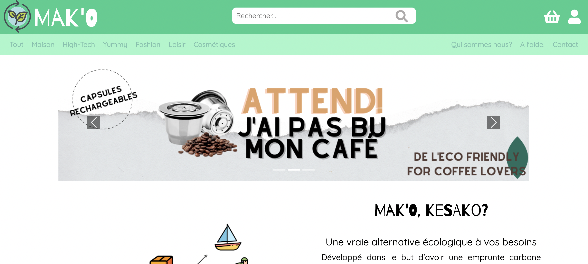
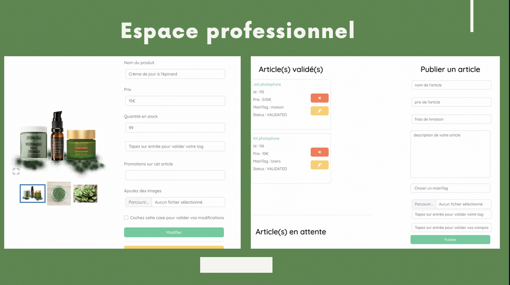
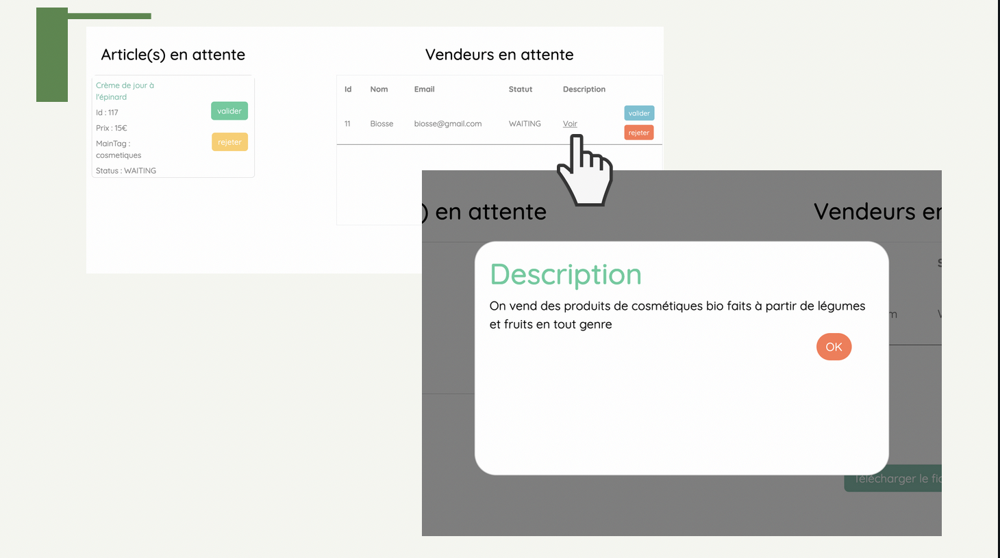
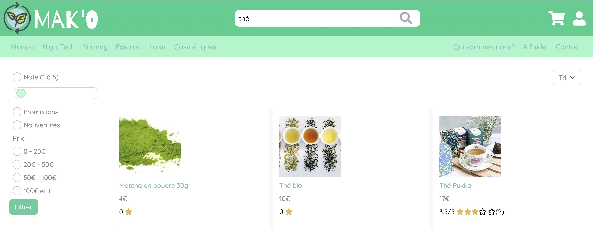
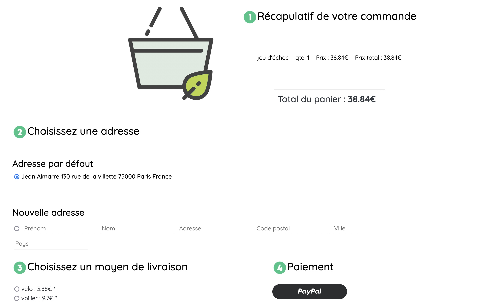

<h1 align="center">Mak'o - une solution E-Commerce écologique</h1>

<h2>Présentation du projet</h2>

 Et si? Il y avait une plateforme alternative plus respectueuse de l'environnement que la grande plateforme <i>A****n</i> -vous la connaissez tous-
dont le système de livraison serait plus écologique, descendant considérablement votre empreinte carbone ? Cette solution s'appelle <b>Mak'o</b>!

J'ai eu le plaisir d'implémenter ce projet en compagnie de:
<ul>
  <li>Cédric </li>
  <li>Corentin <a href="http://github.com/CorentinNrd">son github</a></li>
  <li>Léandre</li>
  <li>Elyess <a href="https://www.linkedin.com/in/elyess-rjafellah-111124223">LinkedIn</a></li>
</ul>

<h2>Installation du projet</h2>

Une fois le répo clôné, vous aurez accès à deux dossiers, le dossier "ecommerce" c'est à dire l'application React (le client) 
et "server" c'est à dire l'API Symfony (le côté serveur)

Dans le dossier ecommerce -> <code>npm install</code>

Dans le dossier server -> <code>composer install</code>

Ces commandes vont ajouter les packages et bundles recquis au bon fonctionnement de l'application. Il ne vous manque plus qu'une étape: le fameux <code>.env</code>

Il vous faut créer un fichier .env dans le dossier server de l'arborescence; ce fichier contiendra vos accès à la base de donnée ainsi que son nom (n'oubliez pas d'en créer une sur MySQL ou PHPMyAdmin!), votre identifiant EmailJS, votre identifiant MailTrap ainsi que cette ligne:<code>CORS_ALLOW_ORIGIN=^https?://.*?$</code>

Une fois l'installation faite, il vous suffit de lancer un serveur node sur le dossier "ecommerce" <code>npm start</code> ainsi qu'un deuxième serveur Symfony dans le dossier "server" avec la commande <code>symfony server:start --no-tls</code> assurez vous d'avoir votre serveur Apache (MAMP, LAMP, etc...) ouvert.

<h2>Mak'o c'est quoi?</h2>

Dans un monde utopique, Mak'o a été imaginé comme une plateforme permettant aux petites ou moyennes entreprises respectant les nouvelles directives écologiques de notre génération d'accéder à un service qui va déléguer la partie logistique web sans frais supplémentaires.

<h3>Comment?</h3>
<h4>Les fonctionnalités du vendeur</h4>

A l'inscription, l'entreprise rempli un formulaire renseignant toutes les informations nécéssaires à Mak'o pour déterminer si leur procédé de production correspond au dogme Mak'o.

Si l'entreprise est validée elle recevra un mail de la part de Mak'o lui indiquant qu'elle a passé cette étape et lui générant un mot de passe aléatoire qu'elle pourra changer sur sa page de profil.

L'entreprise peut ensuite commencer à soumettre ses produits et attendre qu'un administrateur les valide. Elle sera également informée par mail si il y a un refus. L'entreprise peut à tout moment modifier la fiche détaillée de chaque article (stock, promotion, composition, nom etc...), ou les supprimer.

Si un de leur article est acheté l'entreprise sera informée par mail mais Mak'o se chargera de toute la partie packaging, expédition, livraison et suivi des commandes pour lesquels l'acheteur sera averti par mail systématiquement.

Si jamais un des articles mis en vente passe en dessous de 15 items sur la totalité du stock, l'acheteur recevra un mail d'alerte lui indiquant de renflouer les stocks de ce produit en particulier.

 

 
<h4>Les fonctionnalités de l'administrateur</h4>

L'administrateur à partir du tableau de bord, a accès à la liste des vendeurs en attente de validation, la liste des articles en attente de validation, des commandes, de leur statut, il peut tout mettre à jour s'il le souhaite. L'admin peut également générer un fichier excel incluant toutes les infos concernant les utilisateurs et leurs habitudes d'achat (commandes, quantités etc...)

 

 
<h4>Les fonctionnalités du client</h4>

Le client visiteur sur Mak'o peut parcours le large choix du site, faire une recherche en filtrant et triant ses résultats, séléctionner des articles dans son panier, passer sa commande, choisir un tissu cadeau, choisir le lieu de livraison, etc... Le paiement se fait exclusivement par Paypal. Il peut aussi modifier ses informations personnelles telles que son mot de passe ou son adresse. Le client aura aussi accès au tableau de bord de ses commandes pour suivre leur statut et reste informé de toutes ses modifications par mail et peut télécharger sa facture à tout moment.

 

  
  
 

 
<h3>Futures features</h3>

Nous aimerions pour l'avenir, implémenter une API pour qu'à chaque achat, le client puisse planter un arbre dans une zone victime de déforestation massive. Un nouveau pin de localisation viendrait s'ajouter à une map préexistante, disponible à tous les visiteurs du site. Seul le client inscrit aurait accès à ses pins personnels, avec possibilité de les partager sur les réseaux sociaux.

Sinon, d'un point de vue strictement informatique, nous aimerions implémenter un système d'achat en tant qu'invité sur le site, sans obligation de s'inscrire (ce qui n'est actuellement pas le cas)

